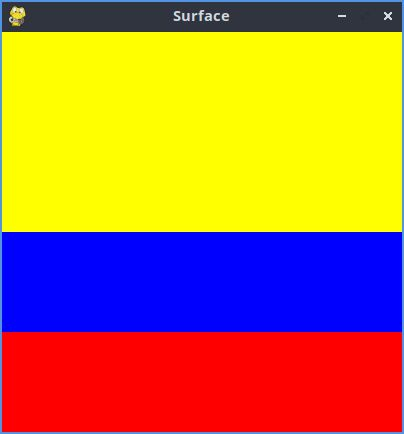

# Estructura de un juego en Pygame

## Inicialización

- Como en todo programa en Python, se debe importar los módulos o librerías a utilizar 
`import pygame`

- Inicializar pygame usando la función init (). Inicializa todos los módulos de pygame importados.
`pygame.init()`

## Visualización de la ventana

`ventana = pygame.display.set_mode((600, 400))`

- set_mode() es la encargada de definir el tamaño de la ventana. En el ejemplo, se está definiendo una ventana de 600 px de ancho, por 400 pc de alto.

`pygame.display.set_caption("Mi ventana")`

- set_caption() es la función que añade un título a la ventana.

- ### función set_mode()

`set_mode(size =(0,0), flags = 0, depth = 0, display = 0)`

- size = (600,400) : define el tamaño de la ventana.

- flags: define uno o más comportamientos para la ventana.
    - Valores:
        - pygame.FULLSCREEN
        - pygame.RESIZABLE
    - Ejemplo:
        - flags = pygame.FULLSCREEN | pygame.RESIZABLE: pantalla completa, dimensiones modificables.

## Bucle del juego = game loop
- Bucle infinito que se interrumpirá al cumplir ciertos criterios.
- Reloj interno del juego
- En cada iteración del bucle del juego podemos mover a un personaje, o tener en cuenta que un objeto a alcanzado a otro, o que se ha cruzado la línea de llegada, lo que quiere decir que la partida ha terminado.
- Cada iteración es una oportunidad para actualizar todos los datos relacionados con el estado actual de la partida.
- En cada iteración se realizan las siguientes tareas:
    1. Comprobar que no se alcanzan las condiciones de parada, en cuyo caso se interrumpe el bucle.
    2. Actualizar los recursos necesarios para la iteración actual.
    3. Obtener las entradas del sistema, o de interacción con el jugador.
    4. Actualizar todas las entidades que caracterizan el juego.
    5. Refrescar la pantalla.

    ## Superficies pygame
    - Superficie: 
        - Elemento geométrico
        - Líne, polígono, imagen, texto que se muestra en la pantalla.
        - El polígono se puede o no rellenar de color.
        - Las superficies se crean de diferente manera dependiendo del tipo:
            - imagen: image.load()
            - texto: font.render()
            - Superficie genérica: pygame.Surface()
            - Ventana del juego: pygame.display.set_mode()

### Bandera de Colombia

```Python

# importamos la libreria pygame
import pygame

# inicializamos los modulos de pygame
pygame.init()

# Establecer titulo a la ventana
pygame.display.set_caption("Surface")

# Establecemos las dimensiones de la ventana
ventana = pygame.display.set_mode((400,400))

# definimos un color
amarillo = (255,255,0)
azul = (0,0,255)
rojo = (255,0,0)
color_aleatorio = ((amarillo, azul, rojo))

# crear una superficie
color_amarillo = pygame.Surface((400,200))
color_azul = pygame.Surface((400,300))
color_rojo = pygame.Surface((400,100))

# Rellenamos la superficie con el color aleatorio
color_amarillo.fill((amarillo))
color_azul.fill((azul))
color_rojo.fill((rojo))

# Inserto o muevo la superficie en la ventana
ventana.blit(color_amarillo, (0,0))
ventana.blit(color_azul, (0,200))
ventana.blit(color_rojo, (0,300))

# Actualiza la visualización de la ventana
pygame.display.flip()

# Bucle del juego
while True:
    event = pygame.event.wait()
    if event.type == pygame.QUIT:
        break

pygame.quit()
```



## Gestión del tiempo y los eventos

### Módulo time

- Este módulo ofrece varias funciones que permiten cronometar la sesión actual (desde el init()) o pausar, la ejecución, por ejemplo.
- Funciones:
    - pygame.time.get_ticks
    - pygame.time.waitpygame.time.delay
    
- Objeto Clock
    - La función tick permite actualizar el reloj asociado con el juego actual.
    - Se llama cada vez que se actualiza la pantalla del juego.
    - Permite especificar el número máximo de fotogramas que se muestran por segundo, y por tanto, limitar y controlar la velocidad de ejecucion del juego.
    - Si insertamos en el bucle de juego la siguiente línea, garantizamos que nunca se irá más rápido que 50 fotogramas por segundo: `Clock.tick(50)`

### Gestión de eventos
- Hay diferentes formas para que para que el programa sepa que se ha desencadenado un evento.
- Es esencial que los programas puedan conocer inmediatamente las acciones del jugador a través de teclado, el mouse, el joystick o cualquier otro periferico

#### Función pygame.event.get
- Permite obtener todos los eventos en espera de ser procesados y que están disponbiles en una cola.
- Si no hay ninguno, entonces se obtiene una colección vacía.

```Python
# Usamos un bucle for para recorrer todos los evetos de la colección obtenida al llamar a la funcion get.
for event in pygame.event.get():
    if event.type == pygame.KEYDOWN:
        if event.key == pygame.K_ESCAPE:
            PARAR_JUEGO = True
```
#### Función pygame.event.wait
- Esta función espera a que ocurra un evento, y en cuanto sucede, está disponible.

```Python
while True:
    event = pygame.event.wait()
    if event.type == pygame.QUIT:
        break
```

#### Función pygame.event.poll
- Devuelve solo uno de los eventos que estan en la cola de espera.

# Sonidos en pygame
- pygame.mixer: módulo que permite la gestión del sonido.
- music: submódulo que gestiona la música de fondo.
- sound: objeto de mixer, que se puede instanciar varias veces para usarlo en los efectos de sonido del juego.


### Archivos de sonido
- Se recomienda usar dos formatos, principalmente:
    - Formato WAV (Waveform Audio File Format)
    - Formato abiertoy gratuito OGG

### Chane (canal) en Pygame
- Un juego tiene varios canales de sonido.
- Se puede asignar un sonido al canal número 1 y otro diferente al número 2.
- Entonces es posible reproducir sonidos simultáneamente activando la lectura en diferentes canales

## Sprites
- Objeto que asocia una ubicación, una representación gráfica (esta o aquella imagen, por ejemplo) y un conjunto de propiedades.
- Estas propiedades  pueden ser un nombre, un texto, valores booleanos que caracterizan el objeto en cuestión (por ejemplo si el objeto se puede mover o no)
- Una posible traducción del termino sprite podría ser "imagen-objeto" que se actualiza con cada iteración del bucle del juego.
- Cuanto mas complejo es el juego, más objetos gráficos tiene que gestionar y actualizar, lo que puede ser tedioso.
- Pygame usa no solo la noción sprite, sino la noción de grupo de sprites (group)
- La noción de group permite agrupar los objetos del mismo timpo. Ejemplo: toso los soldados de un ejercito, lo que se entiende como una colección de instancias de una clase soldado.
- Un determinado procesamiento se puede aplicar a un conjunto o subconjunto de sprites. Ejemplo: cambiar el color de todos los enemigos o hacer invisibles algunos objetos.